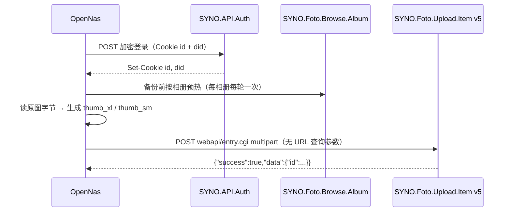

# OpenNas × Synology Photos 对接说明

OpenNas 按**官方 Synology Photos Android App 抓包**实现相册备份，不走 File Station、不走浏览器 upload_worker 回退路径。

## 上传流程



| 步骤 | API | 要点 |
|------|-----|------|
| 登录 | `SYNO.API.Auth` v6/v7/v3 | `session=SynologyPhotos`，`format=cookie`；**不要**带 `enable_syno_token=yes` |
| 认证 | Cookie `id` + `did` | `id` 即登录 sid；`did` 设备标识，跨登录持久化 |
| 预热 | `SYNO.Foto.Browse.Album` | 上传前访问目标相册，建立 Photos 应用上下文 |
| 上传 | `SYNO.Foto.Upload.Item` **v5** `upload` | `album_id`、`require_thumb_version=true`、附带 `thumb_xl`/`thumb_sm` |

上传入口：`FotoApi.UploadToAlbumAsync` → `SynologyClient.UploadItemAppAlbumAsync` → `PostAppAlbumUploadAsync`。

## Multipart 字段（SAZ 3017）

手工拼装（`AppMultipartBuilder`），避免 `MultipartFormDataContent` 给文件 part 多加 `Content-Type` 导致 **108**。

| 字段 | 值 |
|------|-----|
| `api` / `method` / `version` | `SYNO.Foto.Upload.Item` / `upload` / `5` |
| `require_thumb_version` | `true` |
| `name` | `"文件名.jpg"`（带引号） |
| `mtime` / `date` | 10 位 Unix 秒 |
| `folder` | `["PhotoLibrary"]` |
| `album_id` | 目标相册 ID |
| `duplicate` | `"ignore"` |
| `file` | 原图二进制 |
| `thumb_xl` / `thumb_sm` | JPEG 缩略图（文件名 `xl` / `sm`） |
| `model_version` / `raw_data` | 官方 App 附带元数据 |

请求：`POST https://<NAS>:5001/webapi/entry.cgi`，**无** `_sid` 查询参数；Cookie 头仅 `did=...; id=...`。

## 缩略图

`require_thumb_version=true` 时 NAS 使用客户端提交的缩略图，不是服务端重算。

| 平台 | 实现 | 尺寸 |
|------|------|------|
| Android | `AndroidUploadThumbnailFactory`（`BitmapFactory`） | xl 最长边 1920，sm 最长边 360 |
| 桌面 / 其他 | `AppThumbnailGenerator`（ImageSharp） | 同上 |

Android 在 `MauiProgram` 启动时注册 factory，避免 ImageSharp 在 Android 上阻塞主线程。

上传前先 `ReadAppUploadFileBytesAsync` 读入完整文件，再生成缩略图，再拼装 multipart（单文件上限 96MB）。

## 已解决问题

### 登录后上传 HTTP 119

加密登录（SAZ 1406）**不能**带 `enable_syno_token=yes`，否则后续 Cookie POST 全部 119。

### Multipart 108

- 使用手工 boundary 拼装，文件 part 仅 `application/octet-stream`，无多余头。
- 认证用官方 App 的 `did` + `id` Cookie，而非 `_sid` URL 或浏览器 `_SSID`。

### NAS 缩略图灰块、点开黑屏

曾对所有图返回 159 字节 `MinimalJpeg` 占位图，原图正常但 NAS 展示坏缩略图。改为 Android 上用 `BitmapFactory` 生成真实 JPEG 后恢复正常（日志应出现 `thumbs ready xl=... sm=...`，不再是 159）。

### 批量上传约 28 张后崩溃

小图（无需缩放）时 `Bitmap.CreateScaledBitmap` 可能返回**原图引用**；若在 `EncodeScaled` 的 `finally` 里无条件 `Recycle(scaled)` 会提前回收源图，第二次编码触发 `recycle()'d bitmap` → SIGABRT。

修复：仅当 `scaled != source` 时才 `Recycle(scaled)`；xl/sm 编码完成后再统一回收源 `bitmap`。

## 常见错误

| 现象 | 原因 | 处理 |
|------|------|------|
| HTTP 119 | 登录带了 `enable_syno_token` 或 Cookie 会话损坏 | 用官方加密登录；确认 `id`/`did` 有效 |
| JSON 108 | multipart 格式或会话不符合 Photos App | 对照 `AppMultipartBuilder`；确认 Cookie 认证 |
| JSON 105/160 | DSM 权限 | 为用户启用 Synology Photos 个人空间与上传权限 |
| 缩略图灰块 | 上传了占位 `MinimalJpeg` | 确认 Android factory 已注册、log 中 xl/sm 大小正常 |

## HTTP 调试

```csharp
using NSynology.Diagnostics;

SynologyHttpTrace.Enable(msg => System.Diagnostics.Debug.WriteLine(msg));
SynologyHttpTrace.MaxBodyChars = 16384;
SynologyHttpTrace.RedactSecrets = true;
```

Android logcat 标签：`NSynology`、`OpenNasBackup`。

## 代码位置

| 文件 | 职责 |
|------|------|
| `NSynology/Auth/AuthApi.cs` | 加密登录、Cookie 会话 |
| `NSynology/SynologyClient.cs` | 官方相册上传、预热、Cookie 管理 |
| `NSynology/Foto/FotoApi.cs` | `UploadToAlbumAsync`、`WarmupAlbumForBackupAsync` |
| `NSynology/Foto/AppMultipartBuilder.cs` | multipart 手工拼装 |
| `NSynology/Foto/AppThumbnailGenerator.cs` | 缩略图生成 + 平台 factory 注入 |
| `OpenNas/Platforms/Android/AndroidUploadThumbnailFactory.cs` | Android 缩略图 |
| `OpenNas/Services/BackupEngine.cs` | 备份引擎（串行上传，`MaxParallelUploads = 1`） |

## 集成测试

见 `NSynology.Tests/README.md`。核心用例：`AppAlbumUploadTests`（离线契约 + 真机 NAS 上传）。
