# OpenNas

  
  

OpenNas 是一款连接 **群晖（Synology）NAS** 的跨平台应用，让你在手机上浏览 NAS 相册、查看高清原图，并把本机照片自动备份到 NAS。

---

## 适用环境

- **NAS**：已安装并启用 **Synology Photos（相册）** 的群晖 NAS
- **手机**：目前主要面向 **Android**；相册浏览等功能可在已登录后使用，**相册自动备份** 目前仅支持 Android
- **网络**：支持内网与外网访问（可在连接设置中分别配置）

---

## 首次使用

> 目前 Android 版本功能最完整；iOS 与 Windows 支持浏览功能，自动备份正在适配中。

### 1. 配置 NAS 连接

在登录页点击 **「连接设置」**（或进入「我的」→ **连接设置**），添加你的 NAS：

| 项目 | 说明 |
|------|------|
| 显示名称 | 便于识别的名称，如「家里 NAS」 |
| NAS 地址 | 通常为 `https://你的地址:5001`（建议使用 HTTPS） |
| 网络类型 | **内网**：局域网访问；**外网**：公网或 QuickConnect 等远程访问 |

可保存多条连接（内网、外网各一条），并随时切换当前使用的 NAS。

  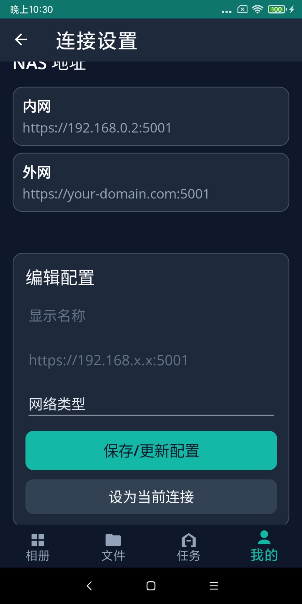

### 2. 登录

输入 DSM **用户名** 和 **密码** 后点击 **登录**。

- 若上次登录尚未过期，打开应用时会 **自动进入**，无需重复输入密码
- 登录页会显示当前选中的 NAS 地址，便于确认连接是否正确

  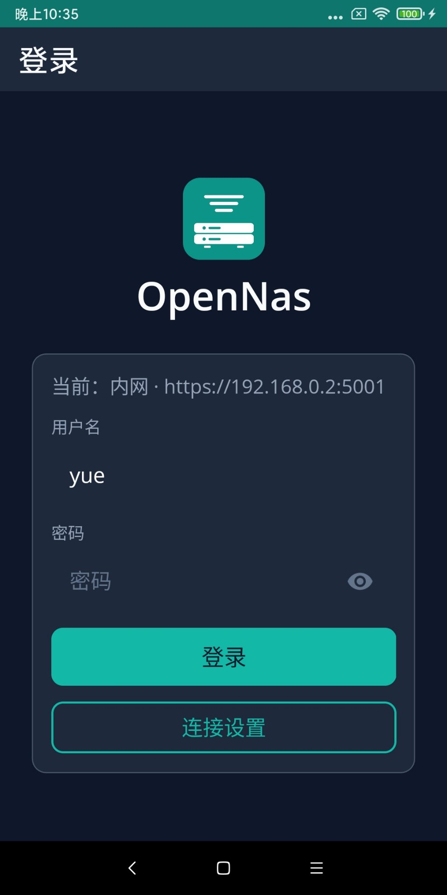

---

## 主要功能

应用底部有四个标签页：**相册**、**文件**、**任务**、**我的**。

### 相册

浏览 NAS 上 Synology Photos 中的相册与照片。

- **相册列表**：网格展示所有相册及照片数量
- **排序**（右上角 ⇅）：按创建时间、更新时间或名称排序
- **新建相册**（右上角 +）
- **下拉刷新**：重新加载相册列表

  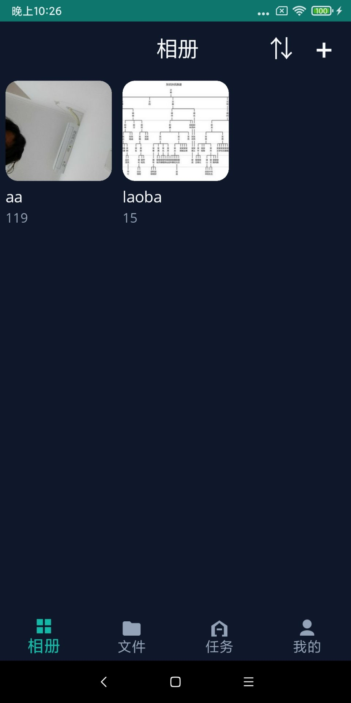
  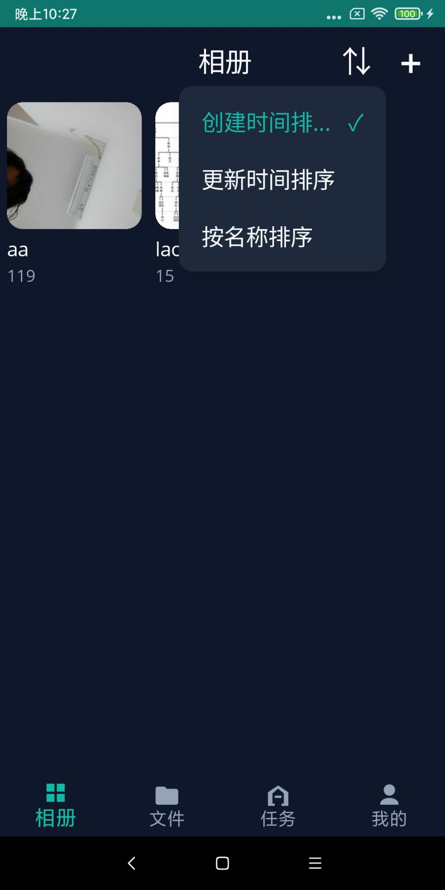

**进入相册**后，可查看其中的全部照片：

- 支持按 **拍摄时间**、**文件名称**、**文件大小** 排序
- 按拍摄时间或文件大小时，照片会 **分组显示**（如按日期、按大小区间）
- 向下滚动自动加载更多；下拉可刷新
- 点击任意照片进入全屏原图浏览

  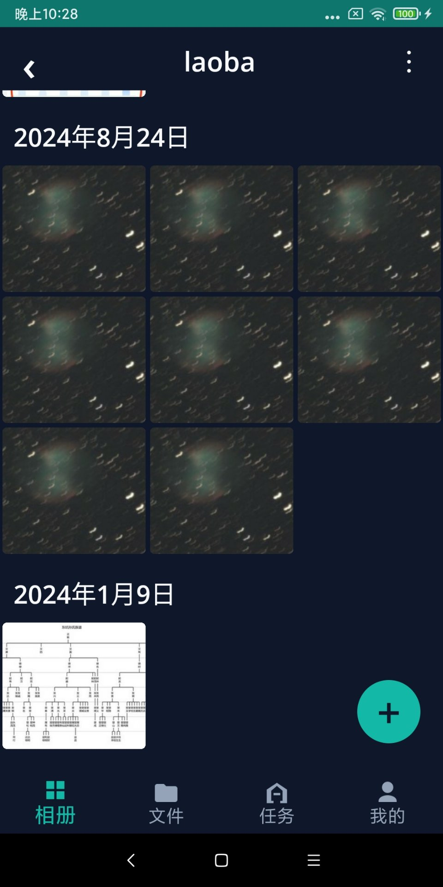
  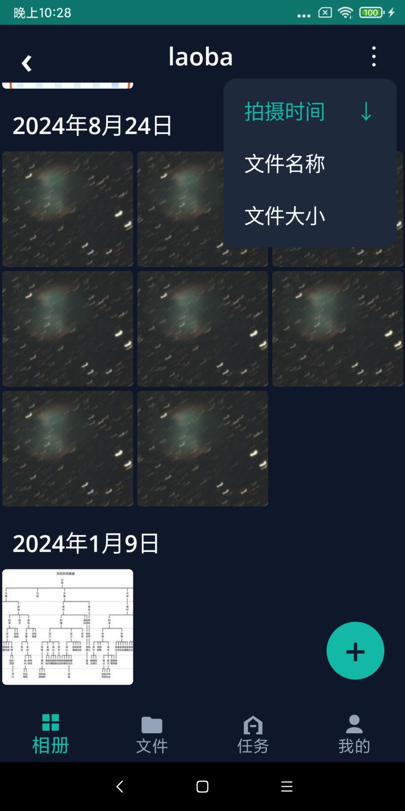

### 文件

File Station 文件浏览与管理功能 **正在开发中**。当前可通过「相册」浏览照片，通过「任务」配置自动备份。

### 任务

将 **手机本机相册** 中的照片/视频，按规则自动备份到 **NAS 指定相册**（目前仅 Android）。

**添加备份规则**（右上角 +）：

1. 选择本机相册（如「相机」「截图」等）
2. 选择 NAS 上的目标相册，或新建一个相册
3. 选择备份成功后是否 **删除手机上的原文件**（请谨慎选择，删除后不可恢复）

  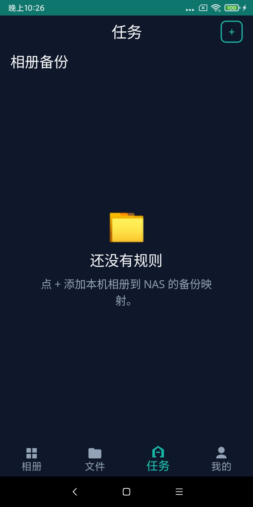
  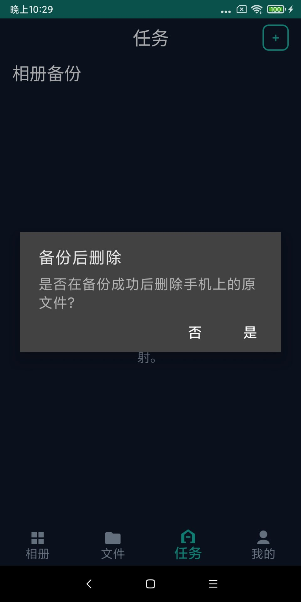

**管理规则**：

- 点击规则可 **启用/停用**、切换「备份后删除」或 **删除规则**
- 备份进行中可查看 **进度** 与队列（当前上传文件、待上传列表）
- 失败时可点 **重试**；运行中可暂停

  
  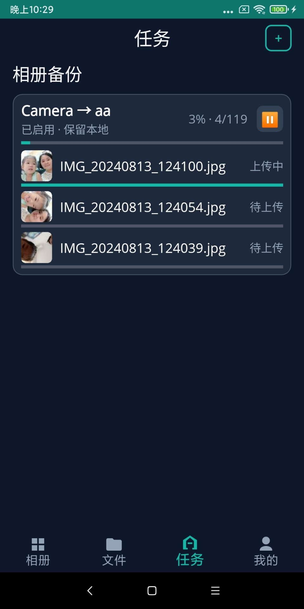

备份会在后台进行；可在「我的」→ **备份策略** 中设置是否仅在 Wi-Fi 下备份。

### 我的

账号与 NAS 连接的管理中心。

| 功能 | 说明 |
|------|------|
| **切换** | 在已保存的多条 NAS 连接之间快速切换 |
| **连接设置** | 添加、编辑、删除 NAS 地址，设为当前连接 |
| **备份策略** | 仅 Wi-Fi 时备份；开启「备份后删除」前需确认风险说明 |
| **清理缓存** | 清除已缓存的缩略图与原图，释放手机存储空间（下次浏览会重新从 NAS 下载） |
| **退出登录** | 退出当前账号，返回登录页 |

  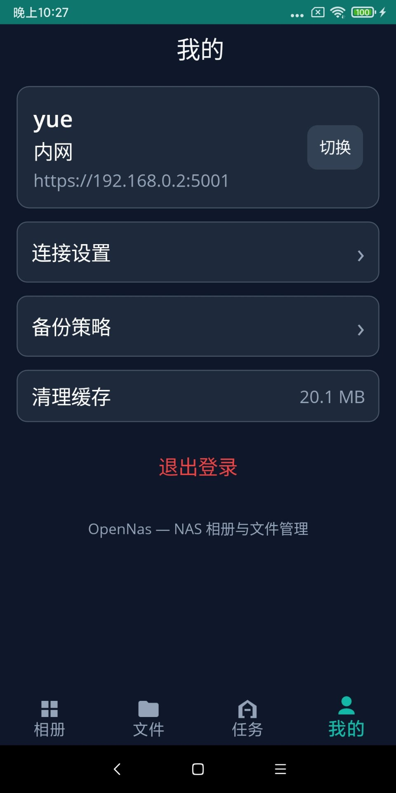
  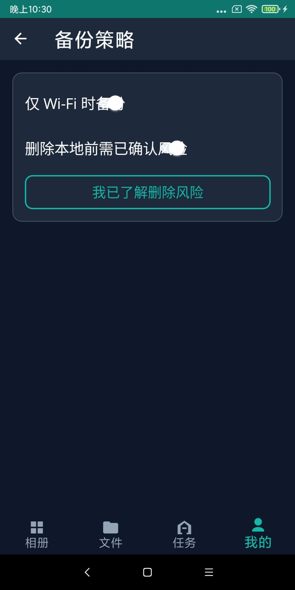

---

## 大图浏览

在相册详情中点击照片后，可全屏查看 **原图**：

| 操作 | 效果 |
|------|------|
| 左右滑动 | 切换上一张 / 下一张 |
| 双指捏合 | 放大、缩小 |
| 单指拖动（放大后） | 平移查看细节 |
| 向下滑动 | 关闭大图，返回相册 |

浏览过的图片会缓存在本机，加快再次打开的速度；不需要时可到「我的」清理缓存。

---

## 备份与删除说明

- **备份后删除** 会在确认文件 **已成功上传到 NAS** 后，再删除手机上的副本
- 删除操作 **不可恢复**，请务必确认 NAS 上已有完整备份
- 首次开启「备份后删除」相关选项前，需在 **「我的」→ 备份策略** 中阅读并确认风险说明
- 建议开启 **「仅 Wi-Fi 时备份」**，避免消耗大量移动数据

---

## 应用权限说明

备份与浏览功能需要以下权限（仅在必要时使用）：

- **网络**：连接 NAS，上传与下载照片
- **读取照片与视频**：扫描本机相册以执行备份
- **通知**（如系统提示）：备份任务进行时的状态提醒

首次添加备份规则时，若未授权访问照片，应用会提示你授予相应权限。

---

## 常见问题

**打不开 NAS 或登录失败？**

- 检查 NAS 地址是否正确（含 `https://` 与端口号，常见为 `5001`）
- 确认手机与 NAS 在同一局域网（内网连接），或外网地址可从当前网络访问
- 核对 DSM 用户名、密码是否正确

**相册是空的？**

- 确认 NAS 上 Synology Photos 中已有相册与照片
- 下拉刷新相册列表

**切换 NAS 后内容不对？**

- 在「我的」确认当前连接是否正确，必要时重新登录

**备份一直不动或失败？**

- 检查网络与 NAS 是否在线
- 在「任务」中点 **重试**
- 确认已允许应用访问照片，且未在仅 Wi-Fi 模式下使用移动数据

**手机存储占用变大？**

- 浏览照片会产生缩略图与原图缓存，可在「我的」→ **清理缓存** 释放空间

---

OpenNas — 让 NAS 相册触手可及。
